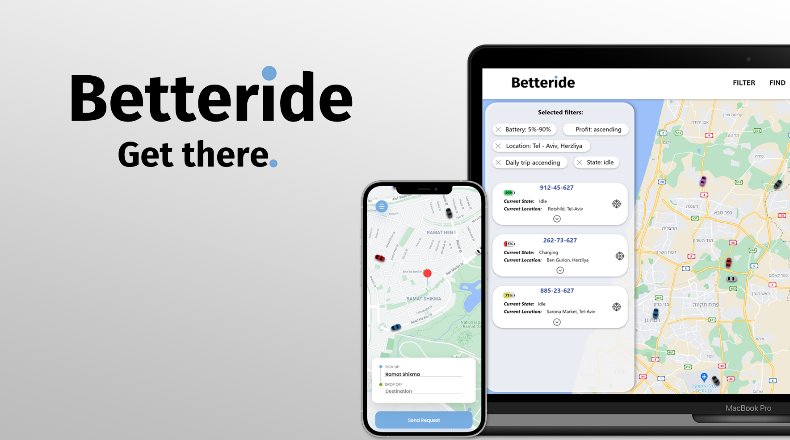

# Betteride Admin Panel
The Betteride Admin Panel is a web application that allows admins to view and manage data related to the Betteride fleet. This includes data such as vehicle location, status, and battery level. Admins can also use the panel to control vehicles, such as starting and stopping them or sending them to specific locations.

Features:  
🚗 View real-time vehicle location, status, and battery level 
🚙 Control vehicles, such as starting and stopping them or sending them to specific locations 
🏎️ Generate reports on vehicle usage and performance 

